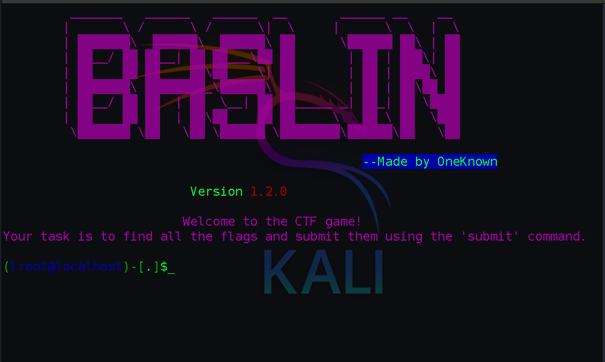
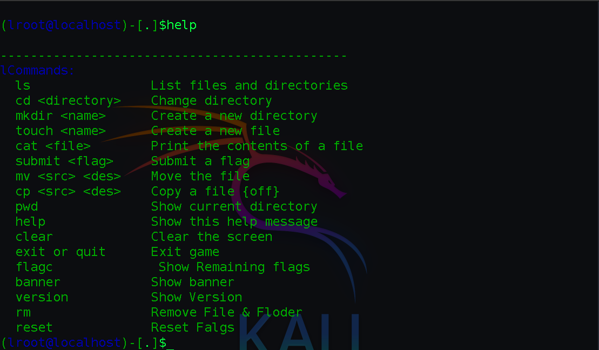
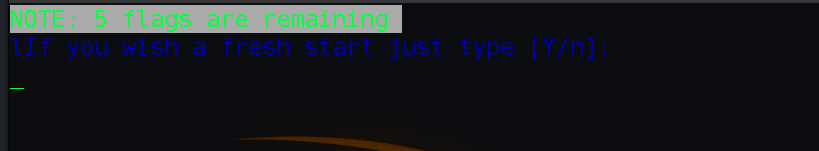
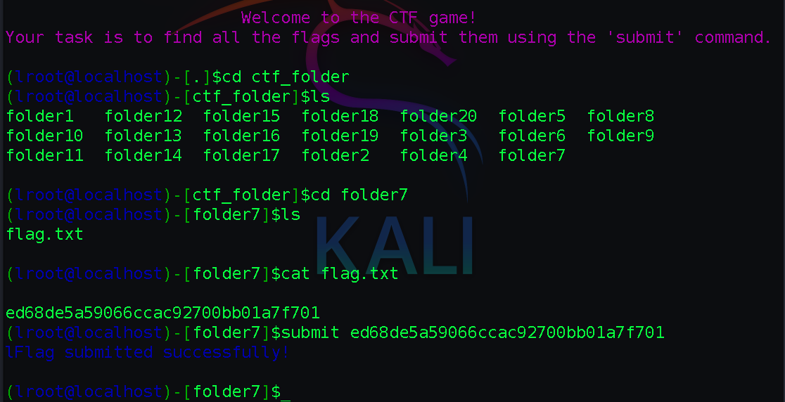

# Capture The Flag (CTF) Bash Script 


#### Overview
This program is designed like a Capture The Flag (CTF) game. The main goal is to find and submit flags. This script is capable 
of validating submitted flags and keeping track of the remaining flags. It utilizes various hash algorithms to create a 
challenging and dynamic game environment

### The main objective is to use and learn basic Linux commands.

# Install


```bash
git clone https://github.com/OneKnow654/BASLIN.git
cd BASLIN  
sudo chmod +x Game.sh
./Game.sh
```
##### after run Game.sh the UI



##### type help in cmd it will print all command that are work in the game




##### how to contiune after exit just type Y/N from option



##### how to submit a flag using submit `flags`



### Conclusion

This script serves as a basic framework for a CTF game, providing essential functionalities for generating, validating, and tracking flags.
